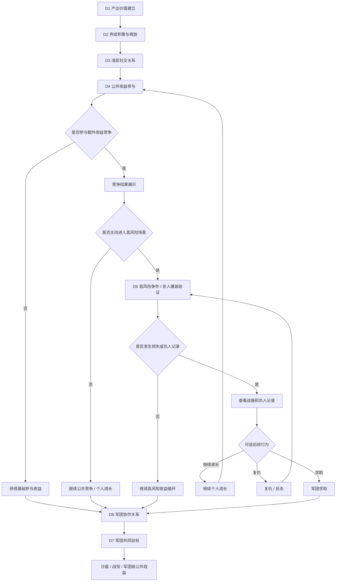
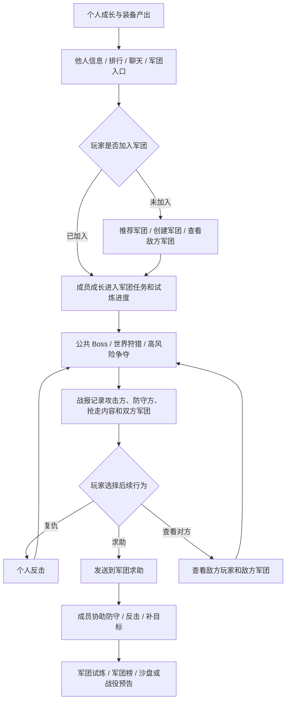

# FF｜7日强社交功能链路细化设计稿

> 基于 `FF-7日强社交功能链路梳理.md` 继续细化。本文为研究稿，不替代后续单功能 GDD。
> 参考表达标准：`reference/部门标准/策划/gdd/GDD写作标准.md` v18。
> 本版修正重点：保留资源争夺和军团承接，明确基础收益、临时收益、失败去向、不同玩家首周位置，以及低活跃玩家的参与方式。

---

## 一、细化目标

- 将首周强社交从“功能开放顺序”细化为“关系递进链路”：先让玩家看见他人，再用高价值产出把玩家带入同场竞争，最后通过击杀战报、仇人、复仇和求助把个人冲突导向军团协作。
- 将 D4-D5 的资源冲突细化为连续行为：高价值产出吸引参与，竞争手段决定额外收益，击杀或被击杀留下战报，复仇与求助推动后续协作。
- 明确军团可以从 D1 露出，但 D6-D7 的重点不是“开放军团按钮”，而是让已有军团关系承担求助、协助、防守、分工和共同目标。
- 控制首周资源争夺的挤压感：普通玩家进入公共场景有基础收益，弱势军团有保底目标，小 R / 非 R 可以通过活跃和协作贡献，低活跃玩家不会被每日定时活动直接劝退。

## 二、设计口径

首周不追求一次性做深所有强社交玩法，也不要求所有玩家都经历被抢。真正要建立的是一条可理解、可承接、可继续放大的强社交主线：

```text
个人产出循环成立
  -> 养成积累可释放
  -> 看见他人、比较战力、查看信息
  -> 高价值公共目标吸引同场参与
  -> 额外收益竞争形成弱竞争
  -> 高风险争夺产生击杀战报和仇人关系
  -> 被击杀后的复仇、求助带动军团协作
  -> 军团共同目标形成长期预期
```

对应到 D1-D7，设计拆分为：

```text
D1 建立产出价值：推关、掉落、换装、战力提升、军团入口露出
D2 建立养成积累：装备、技能、宠物、任务、七日目标
D3 建立浅层社交关系：同屏、排行、聊天、他人信息、军团信息
D4 建立公共收益参与：世界狩猎、公共 Boss、额外收益竞争
D5 建立高风险争夺：寻血、入侵、防守、战报、仇人、复仇
D6 建立军团协作：求助、协助成员、共同任务、军团保护
D7 建立军团共同目标：军团试炼、军团榜、沙盘/战役预告
```

## 三、7日细化总表

| 天数 | 当日主题 | 核心入口 | 玩家主行为 | 当天要解决 |
|---|---|---|---|---|
| D1 | 产出价值建立 | 冒险主线、装备、自动战斗、军团入口 | 推关、掉落、换装、领取首日目标 | 确认战斗产出可以转化为战力 |
| D2 | 养成积累 | 装备、技能、宠物、任务、七日活动 | 补齐养成项、领取阶段奖励、升级/强化/培养 | 将 D1 产出接入养成线 |
| D3 | 浅层社交关系 | 同屏、排行、聊天、他人信息、军团信息 | 查看他人战力、装备、养成进度，查看聊天和军团信息 | 让玩家确认服务器中存在其他玩家 |
| D4 | 公共收益参与 | 世界狩猎、公共 Boss、额外收益竞争 | 参与公共目标、获得基础收益、争夺额外收益 | 让玩家围绕同一个高价值目标竞争 |
| D5 | 高风险争夺 | 寻血、入侵、防守、复仇、玩法背包 | 获取临时收益，防守或争夺他人临时收益 | 让击杀或被击杀通过战报留下对象 |
| D6 | 军团协作 | 军团任务、成员协助、分工贡献、军团保护 | 求助、协助成员、完成共同任务、查看敌方军团 | 让已有军团关系承担求助和协作 |
| D7 | 军团共同目标 | 军团试炼、军团榜、共同进度、沙盘/战役预告 | 参与军团目标、贡献输出或活跃、查看排名和敌对关系 | 给出后续军团争夺预期 |

## 四、整体流程图



## 五、军团首周承接框架

军团在首周不能只承担签到、捐献、商店和聊天。它需要接住前面已经形成的个人成长、公共收益、高风险争夺、战报仇人和复仇需求，让玩家从“我自己变强”自然转向“我需要一组固定的人一起处理收益和冲突”。

首周军团承接需要固定 7 个设计动作：

1. 从排行、聊天、他人信息、公共结算、战报和仇人记录引导入团。
2. 将个人成长、活跃、公共参与和协助行为转成军团进度。
3. 在他人信息、结算、战报、仇人记录、复仇入口和军团榜展示组织身份。
4. 让公共收益体现“个人可参与，组织更稳定”。
5. 将个人仇人沉淀为可协助处理的战报事件。
6. 为成员协助提供入口、反馈和进度。
7. 用军团试炼、军团榜和沙盘/战役预告给出后续共同目标。

### 5.1 承接目标：接住入团、成长、冲突和长线预期

- 让玩家在看见他人、参与公共收益和经历高风险争夺后，有明确的入团理由。入团入口应出现在他人信息、战报、仇人记录、求助和公共目标结算之后，而不是只放在主界面固定按钮里。
- 让个人成长不只服务个人推关和战力数字。成员战力、活跃、公共目标参与和协助行为应进入军团任务、军团试炼和军团榜的可见进度。
- 让冲突对象可以被记住、被追踪、被协助处理。战报、仇人记录、复仇入口和敌方信息需要展示双方军团，并允许玩家把个人战报发送给本军团请求协助。
- 让首周军团目标从日常活跃过渡到后续军团争夺。军团试炼、军团榜和沙盘/战役预告应展示成员共同完成的目标、可争夺的公共收益和潜在敌对军团。

### 5.2 行为链路：从个人冲突转成组织协作

军团首周承接的是一条从个人成长到组织目标的行为序列：玩家先因为成长和公共收益看见其他玩家，再因为高风险争夺产生战报、仇人和复仇需求，最后通过军团求助、成员协助、共同任务和军团目标，把个人冲突转成组织协作。本文只定义首周军团需要承担的功能行为和边界，不展开军团沙盘、战役活动和完整 GVG 规则。

```text
个人成长有价值
  -> 看见其他玩家和军团信息
  -> 参与公共收益争夺
  -> 战报记录攻击方、防守方和双方军团
  -> 玩家从战报进入复仇、求助或查看敌方军团
  -> 军团成员协助防守、反击或完成共同任务
  -> 军团试炼、军团榜和沙盘/战役预告给出后续共同目标
```

### 5.3 功能关系：成长、战报、求助与军团目标



### 5.4 入团触发：从相关场景回流军团

军团入口应出现在玩家已经看见其他玩家的位置。D1 可以露出军团入口，但真正推动入团的触发点，应来自玩家已经产生“别人和我有关”的场景：排行、聊天、他人信息、公共目标结算、战报和仇人记录。

入团不是孤立动作，而是前置行为后的承接选择。玩家看见强者、同场竞争者或抢走自己收益的人，才会需要固定组织来解释差距、寻找协助、获得更稳定的收益来源。未加入军团的玩家仍能参与公共目标和高风险场景，但会缺少求助对象、成员协助和军团共同进度。

推荐军团不能只展示列表，还要展示加入后能承接的需求：军团任务、成员协助、军团试炼，以及当前战报能否带回军团继续处理。玩家从战报、公共目标或仇人记录进入入团流程后，应回到原场景继续处理当前冲突，而不是被打断到军团主页。

### 5.5 成长接入：把个人结果转成组织进度

军团不能只消耗玩家已经获得的资源，还要把个人成长转成组织可见贡献。否则军团会变成额外负担，而不是个人成长的放大场景。

首周前半段已经让玩家理解推关、掉落、换装和战力提升的价值。军团要做的是把这些个人结果接到共同目标里：推关、装备提升、公共目标参与、寻血防守、复仇或协助行为，都应能推动军团任务、军团试炼或军团榜进度。

贡献不应被压成同一种数值。高战玩家贡献输出和反击能力，活跃玩家补目标和参与试炼，低战玩家通过防守、协助、活跃推进获得贡献。加入较晚的玩家不回溯历史贡献，但加入后的成长行为应立刻进入军团目标，避免入团后只剩签到和捐献。

### 5.6 组织身份：在判断节点展示军团归属

组织身份必须出现在会影响玩家判断的位置：他人信息、公共目标结算、战报、仇人记录、复仇入口和军团榜。玩家需要知道“谁抢了我”，也需要知道“他属于哪个组织”，个人冲突才有机会转成军团协作。

公共 Boss 或世界狩猎结算不能只展示个人名次，还应展示主要参与者及其军团归属。高风险争夺的战报需要同时记录攻击方、防守方、双方军团、被抢内容、保留内容、复仇入口和求助入口，让一次损失变成可追踪对象，而不是一次随机扣除。

首周不需要立刻建立正式宣战或长期敌对规则，但可以先让军团身份进入玩家判断。双方军团短时间多次冲突时，军团界面可以展示近期冲突记录；若攻击方或防守方没有军团，则保留玩家信息和复仇入口，同时露出入团需求。

### 5.7 公共收益：让组织参与提升稳定性

公共目标在首周承担两层功能：先让玩家同场争夺，再让玩家发现组织参与更稳。军团参与不应剥夺单人玩家的基础收益，而应影响额外收益、协助效率、失败后的求助，以及后续共同进度。

单人玩家进入世界狩猎、公共 Boss 或高风险争夺时，仍应获得基础参与收益，保证“我来了就有进度”。军团的价值体现在更高一层：成员能协助补输出、防守、反击，能把公共目标参与转成军团进度，也能在失败后提供求助和再次参与的理由。

如果强军团连续获得额外收益，普通玩家仍要保留基础收益和低门槛军团目标，否则首周公共场景会过早变成头部军团通吃。公共收益的设计重点不是让军团直接分走奖励，而是让玩家理解：个人可以参与，组织参与更稳、更可持续，也更容易承接失败后的下一步。

### 5.8 仇人承接：把个人战报转成可协助事件

仇人记录不是个人名单，而是“把一次损失变成后续行为”的入口。玩家被抢后，需要清楚看到攻击者、攻击者军团、发生场景、损失内容和可选择的处理方式：自己复仇、继续成长、请求军团协助，或查看敌方军团。

个人仇人能否进入军团，取决于战报能否被组织理解。战报发送到军团求助区后，成员看到的不能只是“某人求助”，而要看到目标是谁、发生在哪里、能怎么协助、协助后有什么收益或进度。成员完成协助后，求助玩家也要看到谁参与了协助、是否完成反击或防守，以及这次协助带来的结果。

这套关系不能把玩家推入无限复仇。目标当前不可复仇或场景已关闭时，战报和仇人记录仍然保留，但后续行为可以转向继续成长、查看对方军团、等待下一次开放，或交给军团目标慢慢承接。重复攻击同一玩家时，仇人记录应合并展示最近冲突和累计损失，避免列表被重复战报淹没。

### 5.9 共同目标：用入口、反馈和进度固定协作

成员协作要有清楚的行为入口和结果反馈。首周不需要做完整军团战争，但需要让玩家知道：军团成员可以帮自己处理损失，也可以共同完成目标，并把这些行为积累到军团试炼、军团榜和后续沙盘/战役预告中。

军团内的协作入口来自三类需求：成员战报求助、公共目标请求、军团试炼或任务缺口。成员参与后，结果要回到两端：被协助玩家看到求助事项是否被处理，参与成员获得个人奖励、军团贡献或军团进度。协作不是聊天里的口头帮忙，而是有入口、有反馈、有共同进度的行为。

共同目标不能只服务高战玩家。成员战力不足时，仍可通过活跃、补目标、协助防守或参与试炼获得贡献；军团未能完成阶段目标时，也应保留已获得的基础进度奖励。军团达到首周目标时，不需要承诺完整军团战争已经开放，而是展示后续沙盘/战役的目标类型、公共收益和可能的对抗对象，让玩家知道这组人后面还有事可做。
