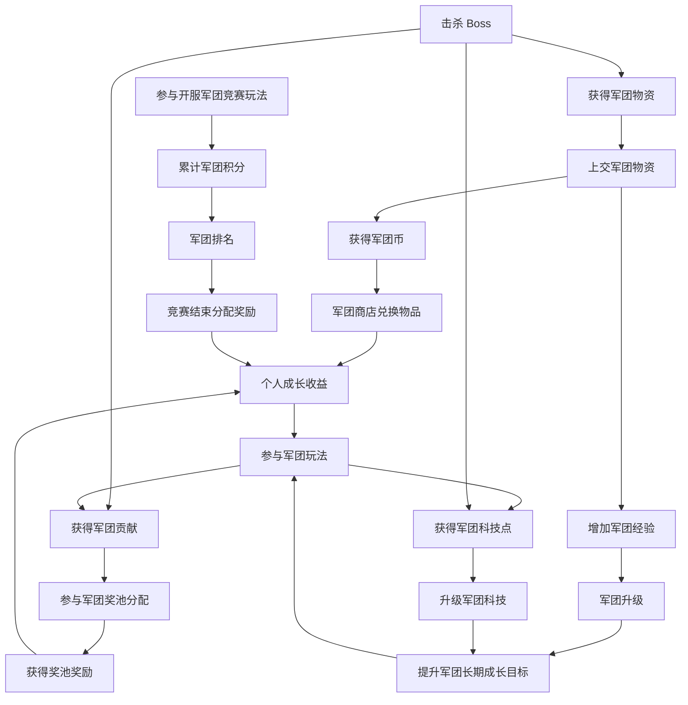

# FF / 指尖战记 - 军团系统资源循环草稿

> 非正式草稿，仅用于继续讨论；不是正式 GDD。

## 资源定义

| 资源 | 归属 | 来源 | 用途 | 定位 |
|---|---|---|---|---|
| 军团币 | 个人 | 捐献 / 上交军团物资获得 | 军团商店兑换物品 | 个人消费货币 |
| 军团物资 | 个人先获得，可上交军团 | 击杀 Boss 获得 | 上交后转成个人军团币，并为军团提供军团经验 | 个人可上交资源 |
| 军团经验 | 军团 | 成员捐献 / 上交军团物资时获得 | 军团升级 | 军团等级成长值 |
| 军团科技点 | 军团 | 军团玩法、Boss 掉落获得 | 军团科技升级 | 军团科技成长资源 |
| 军团贡献 | 个人 | 击杀 Boss、参与军团玩法获得 | 军团奖池分配依据 | 个人分配权重 |
| 军团积分 | 军团 | 开服军团竞赛期间，成员参与各种玩法获得 | 军团竞赛排名，结束后按排名分配奖励 | 军团竞赛计分 |

## 循环图

## 当前边界

- 集结不进入资源循环图。
- 集结只作为会长 / 副会长在玩法过程中召集成员到当前玩法现场的轻量工具。
- 军团币、军团经验、军团贡献、军团物资、军团积分、军团科技点不能混成同一类账户。
- 军团贡献是奖池分配依据，不是已定义的消费货币。
- 军团积分是开服军团竞赛计分，不是军团经验，也不是军团币。
