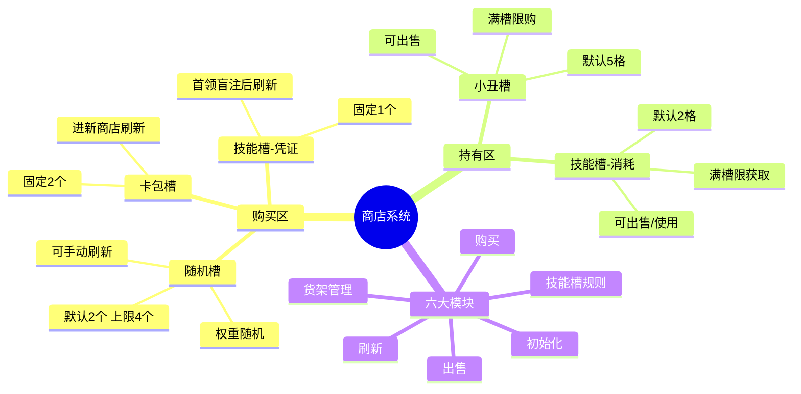
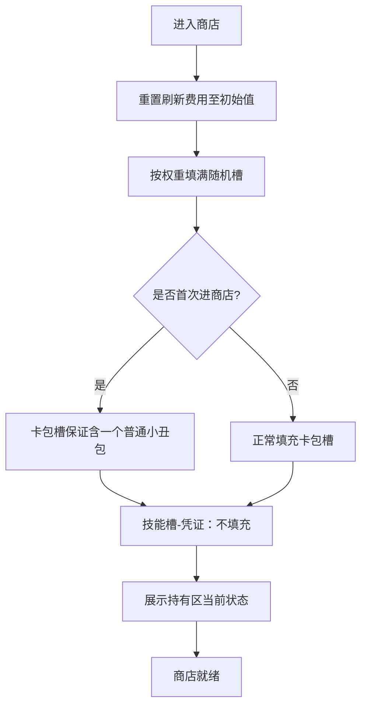
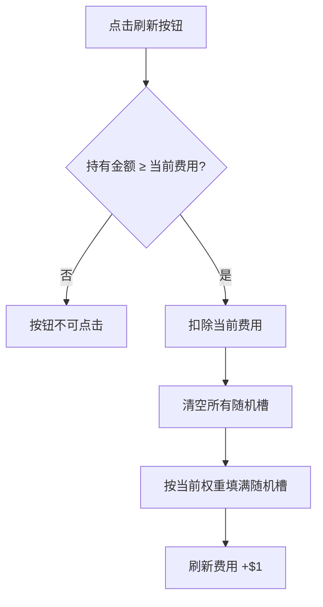
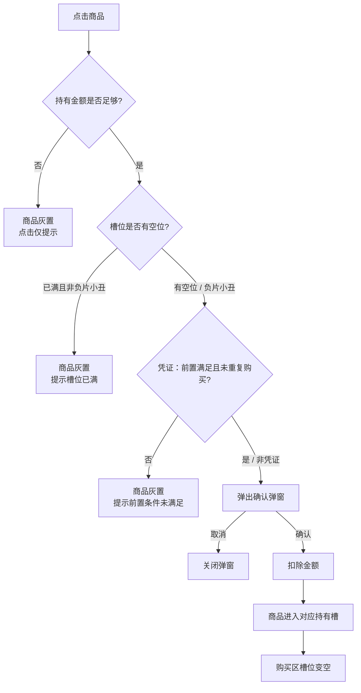
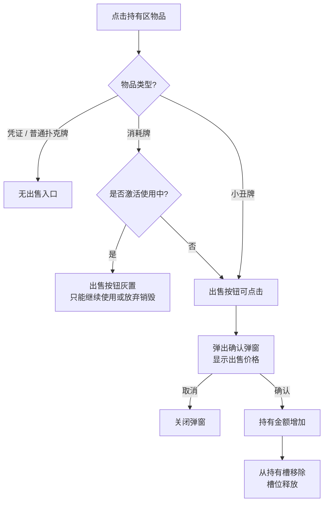

# [游戏名] 商店系统

功能负责人：
所属版本：
审核人：
上线日期：

文档更新：
2026年5月22日 - 初稿
参照 Balatro 商店设计，来源：balatrowiki.org

---

## 模块概览

商店由六个模块构成，职责如下：

| 模块 | 职责 |
|---|---|
| 货架管理 | 维护四类槽位的结构、数量、容量与状态 |
| 初始化 | 进入商店时按槽位类型完成填充 |
| 刷新 | 手动重新生成随机槽内容，费用逐次递增 |
| 购买 | 从点击商品到商品进入持有槽的完整流程 |
| 出售 | 持有区内小丑牌与消耗牌的资产回收流程 |
| 技能槽规则 | 消耗类与凭证类在持有、使用、生效上的差异化行为 |



---

## 一、货架管理

商店界面分为购买区与持有区，共四类槽位：

**购买区**

| 槽位 | 默认数量 | 上限 | 手动刷新 | 刷新时机 |
|---|---|---|---|---|
| 随机槽 | 2 | 4 | ✅ | 手动刷新 / 进新商店 |
| 卡包槽 | 2 | 2 | ❌ | 进新商店 |
| 技能槽（凭证） | 1 | 1 | ❌ | 击败首领盲注后 |

**持有区**

| 槽位 | 默认容量 | 上限 | 可出售 | 满槽限制 |
|---|---|---|---|---|
| 小丑槽 | 5 | 可扩展 | ✅ | 满槽无法购入新小丑牌（负片版本除外） |
| 技能槽（消耗） | 2 | 可扩展 | ✅ | 满槽无法获取新消耗牌 |

**随机槽出现权重（默认）**

小丑牌约 70%、塔罗牌约 15%、星球牌约 15%、幽灵牌接近 0。
权重受凭证动态修改，建议全部配置化。

---

## 二、初始化

**触发时机**：进入商店时执行一次。购买和刷新均不触发此流程。

**执行顺序**：

1. 将本次商店的刷新费用重置为当前初始值（默认 $5，可被凭证修改）
2. 随机槽：按当前权重填满所有空槽
3. 卡包槽：按规则填充（首次进商店保证含一个普通小丑包）
4. 技能槽（凭证）：不在此步填充，由击败首领盲注后的独立逻辑控制
5. 持有区（小丑槽 / 技能槽消耗）：不需要初始化，直接展示玩家当前持有状态



---

## 三、刷新

**作用范围**：仅随机槽。卡包槽与技能槽（凭证）不受影响。

**费用规则**：

- 本次商店内第一次刷新：当前初始费用（默认 $5）
- 每次刷新后费用 +$1
- 进入新商店时费用重置为初始值
- 初始费用可被凭证降低（重掷优惠降至 $3，重掷大放送降至 $1）

**前置条件**：持有金额 ≥ 当前费用，否则刷新按钮不可点击。

**执行流程**：

1. 检查持有金额是否满足当前费用
2. 扣除费用
3. 清空所有随机槽（含已被购买的空槽）
4. 按当前权重重新填满所有随机槽
5. 本次商店刷新费用 +$1



---

## 四、购买

**价格公式**：

```
实际价格 = 向下取整（(基础价格 + 版本加价) × 折扣系数）
```

版本加价：

| 版本 | 加价 |
|---|---|
| 闪光 | +$2 |
| 全息 | +$3 |
| 多彩 | +$5 |
| 负片 | +$5 |
| 无版本 | +$0 |

折扣系数默认为 1.0，由凭证修改（清仓大甩卖 × 0.75，全面清仓 × 0.50）。折扣作用于含版本加价后的总价再取整。

**容量前置检查**（点击商品后先行判断）：

| 商品类型 | 检查目标 | 例外 |
|---|---|---|
| 小丑牌 | 小丑槽是否有空位 | 负片版本小丑牌自带 +1 槽位，满槽时仍可购入 |
| 消耗牌 | 技能槽（消耗）是否有空位 | 无 |
| 卡包 | 无容量限制 | — |
| 凭证 | 是否已购买过同款 / 前置是否满足 | — |

**购买流程**：

1. 玩家点击商品
2. 执行容量前置检查与金额检查
3. 检查通过 → 弹出确认弹窗（显示实际价格与效果说明）
4. 确认 → 扣除金额 → 商品进入对应持有槽 → 购买区槽位变空
5. 取消 → 关闭弹窗，不做任何操作



**失败条件**：

| 条件 | 表现 |
|---|---|
| 持有金额不足 | 商品灰置，点击仅弹提示，不弹确认弹窗 |
| 小丑槽 / 技能槽已满 | 商品灰置，点击提示"槽位已满" |
| 凭证前置未满足 | 商品灰置，点击提示"需先购入 XX" |
| 该凭证本局已购 | 商品灰置，点击提示"本局已购买" |

---

## 五、出售

**可出售**：小丑槽内的小丑牌、技能槽（消耗）内的消耗牌
**不可出售**：已生效的凭证（购买即生效不占槽）、普通扑克牌

**价格公式**：

```
出售价格 = 向下取整（购买时实际价格 ÷ 2），最低 $1
```

出售价格基于购买时的实际价格，不受当前商店折扣影响。

**消耗牌边界**：已点击使用进入激活流程的消耗牌，出售入口灰置，只能继续使用或放弃（销毁，不返还金额）。

**执行流程**：

1. 点击持有区内的小丑牌或消耗牌，出售按钮可点击
2. 弹出确认弹窗，显示出售价格
3. 确认 → 持有金额增加 → 从持有槽移除 → 槽位释放
4. 取消 → 关闭弹窗



---

## 六、技能槽规则

技能槽内有两种性质不同的物品，行为必须分开处理：

### 消耗类

- 持有于技能槽（消耗），占用槽位容量，上限为当前技能槽容量
- 可在任意阶段点击使用，使用后从槽位移除
- 商店阶段可出售，使用激活中不可出售
- 来源：随机槽购买、卡包开启

### 凭证类

- 显示于技能槽（凭证）购买区，不占用持有槽容量
- 每种凭证每局限购一次，购买后效果永久生效，不可出售、不可移除
- 刷新时机独立：击败首领盲注后自动刷新，与商店初始化和手动刷新无关
- 存在前置链，升级版需先购入初级版方可解锁购买

**凭证前置链**：

| 初级 | 升级 | 说明 |
|---|---|---|
| 超量进货 | 超量进货升级 | 随机槽 +1；升级版购买后立即按初始化逻辑补满当前空槽 |
| 清仓大甩卖 | 全面清仓 | 折扣系数 ×0.75；升级后变为 ×0.50 |
| 重掷优惠 | 重掷大放送 | 刷新初始费用降至 $3；升级后降至 $1 |
| 塔罗商人 | 塔罗大亨 | 随机槽塔罗牌权重 ×2；升级后再 ×2 |
| 星球商人 | 星球大亨 | 随机槽星球牌权重 ×2；升级后再 ×2 |

**凭证按影响模块分类**：

| 影响模块 | 对应凭证 |
|---|---|
| 货架管理（槽位数量） | 超量进货 / 超量进货升级 |
| 货架管理（随机槽权重） | 塔罗商人 / 塔罗大亨 / 星球商人 / 星球大亨 |
| 购买（折扣系数） | 清仓大甩卖 / 全面清仓 |
| 刷新（初始费用） | 重掷优惠 / 重掷大放送 |
